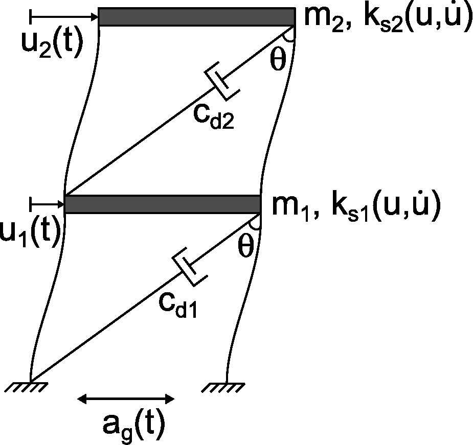
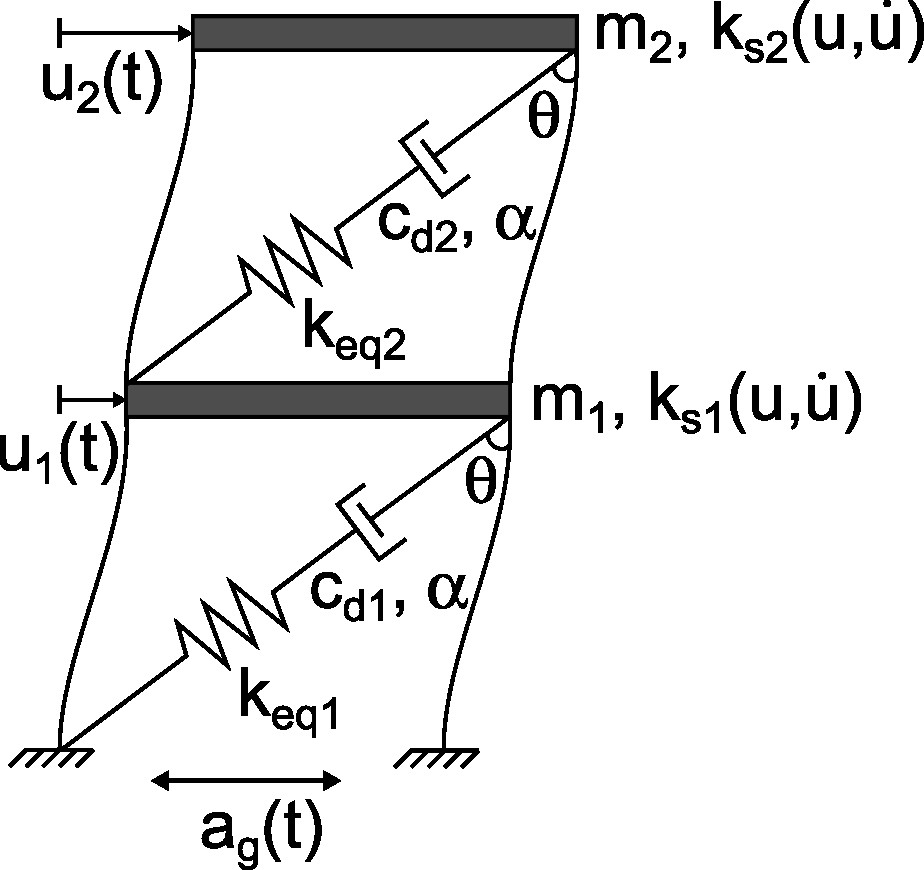
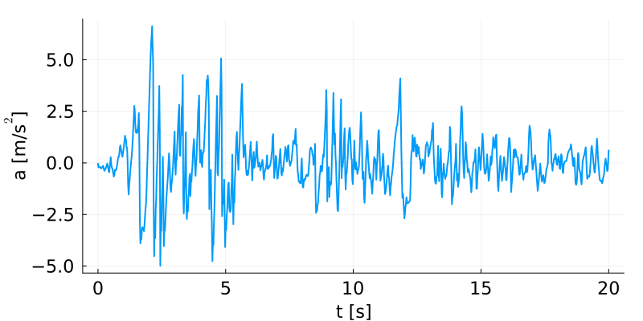

# SAND optimization of nonlinear fluid viscous dampers (FVDs)

Size and placement of nonlinear fluid viscous dampers with a simultaneous analysis and design (SAND) optimization approach. The approach is used for retrofitting nonlinear hysteretic structures subjected to transient seismic excitation.

The code shared in this respository can be used for reproducing the numerical results of the examples discussed in:   
> Pollini N. (2024). Simultaneous analysis and design optimization for seismic retrofitting of hysteretic structures with fluid viscous dampers. Journal of Building Engineering.      

In particular:
- The code `PAPER_DampOpt_SAND_2D_Fy.jl` reproduces the results of section 6.1;   
- The code `PAPER_DampOpt_SAND_2D_Fy_Fd_cdkd.jl` reproduces the results of section 6.2.   

In the example of section 6.1 we consider a 2D shear frame structrue, with nonlinear hysteretic behavior and retrofitted with linear fluid viscous dampers:  
    

In the example of section 6.2 we consider a 2D shear frame structrue, with nonlinear hysteretic behavior and retrofitted with nonlinear fluid viscous dampers:  
   

In both cases, the structures are subjected to a seismic groudn excitation defined by the following gound acceleration (El Centro):   
 
